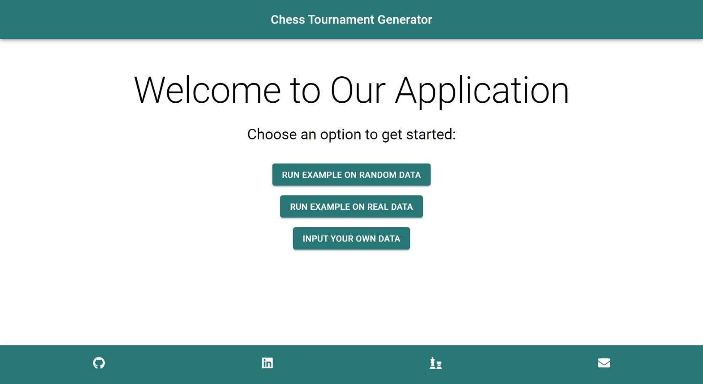
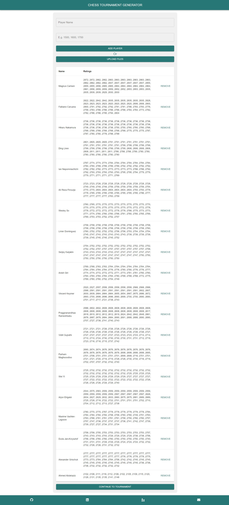
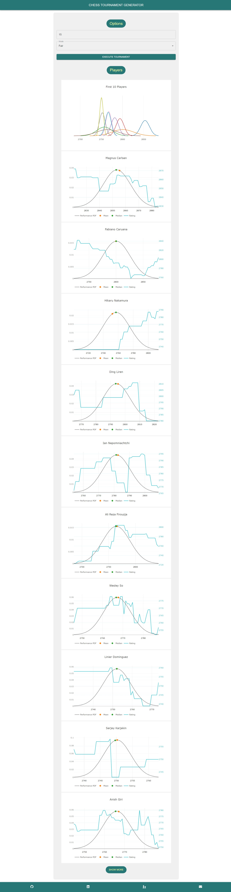
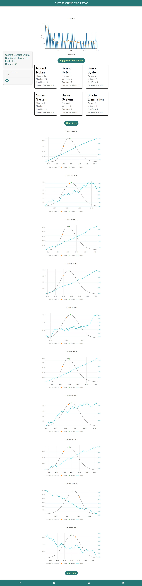
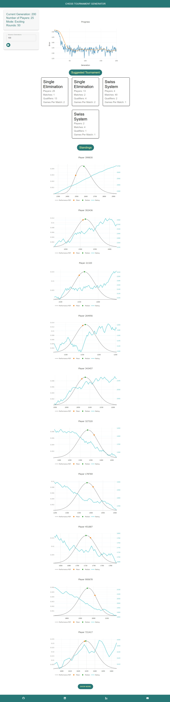

**Session 13: Wrap Up**

In this session, I completed the **user interface** (UI) design and implementation for my project. I also experimented with the app through the browser and fixed some issues related to the interface and user experience.

#### UI Design and Implementation:

The UI design and implementation was the final step of my project, as it aimed to provide a **graphical** and **interactive** way for the users to use and test my app. For that task, I used React.js for rapid and easy development. The UI consists of three main pages:

-   **Home page**: This is the first page that the user sees when they open the app. It allows the user to choose how to input their data, either by manually entering the players’ information, uploading a JSON file, generating random players, or using a predefined dataset of the top 20 players worldwide in classical chess as of January 2024.
-   **Customization page**: This is the page where the user can customize their tournament settings, such as the number of rounds, the number of games per match, the mode (fair or exciting), and the fitness function. It also shows a preview of the players’ representation, such as their names, ratings, mean, and median.
-   **Results page**: This is the page where the user can see the optimized tournament format and the standings after executing the tournament. It also allows the user to advance through generations and see how the tournament formats and standings change over time.

#### Experimentation and Fixes:

After implementing the UI, I experimented with the app through the browser and checked its functionality and performance. I also fixed some issues that I encountered during the experimentation, such as:

-   **Validation**: I added some validation rules and error messages to ensure that the user inputs valid and consistent data, such as the number of players, the ratings, the number of rounds, and the number of games per match.
-   **Responsiveness**: I adjusted some CSS properties and media queries to make the UI responsive and adaptable to different screen sizes and devices. However, the app is still highly optimized for Desktop users.
-   **Visualization**: I improved the visualization of the results by using charts and tables to display the tournament formats and standings.

**The following are some screenshots from the UI:**

> Home Page:
> 

> Input Players Page:
> 

> Tournament Page:
> 

> Results - Fair Mode:
> 

> Results - Exciting Mode:
> 

---

[← Previous](Session12.md) | [Next →](./Session14.md)